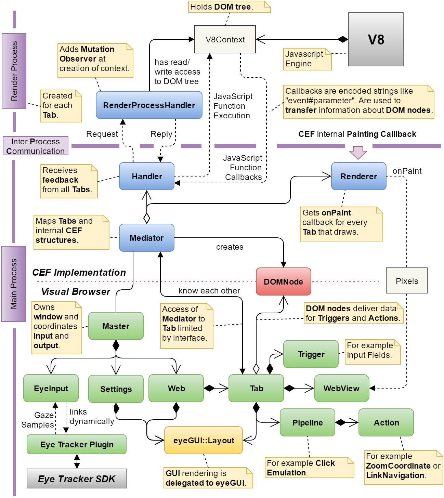
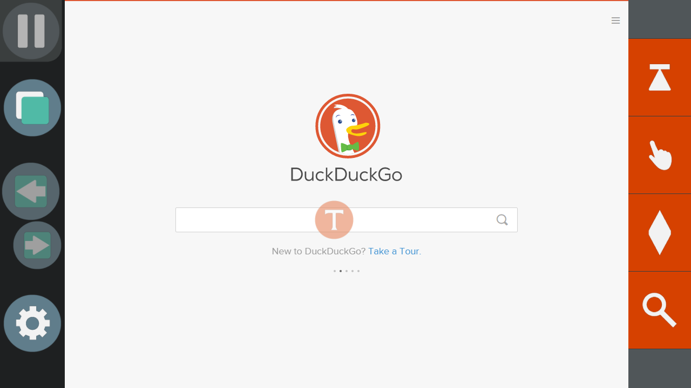
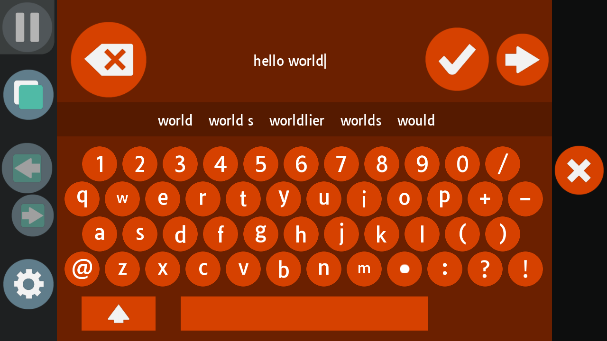
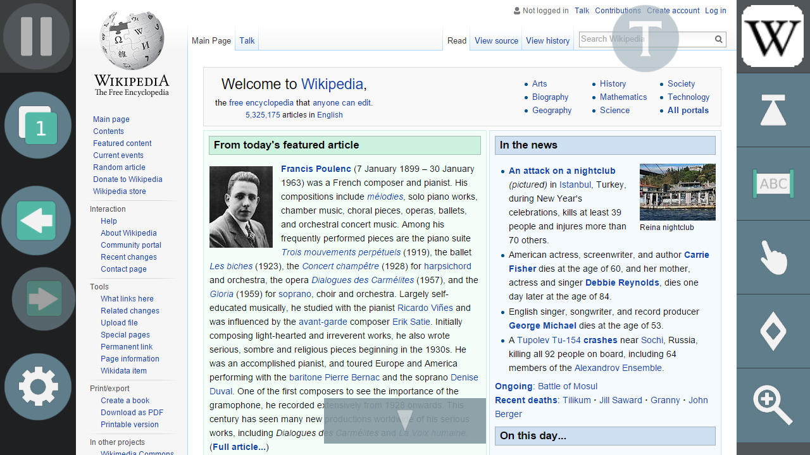
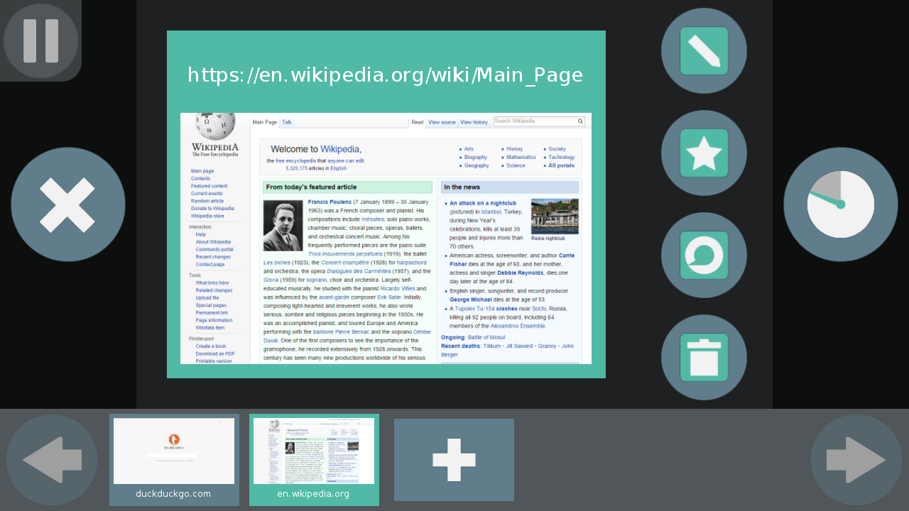

# GazeTheWeb - Browse: Client
Gaze-controlled Web browser, part of the EU-funded research project MAMEM.

## Structure


## HowTo
Please refer to the Readme in the [parent folder](https://github.com/MAMEM/GazeTheWeb/tree/master/Browse) for details about compiling.

For configuration, edit the lines in _src/Setup.h_:
```C++
// Window
static const bool FULLSCREEN = false;
static const int INITIAL_WINDOW_WIDTH = 1280;
static const int INITIAL_WINDOW_HEIGHT = 720;

// Control
static const float DURATION_BEFORE_INPUT = 1.f; // wait one second before accepting input
static const bool PAUSED_AT_STARTUP = false;
static const float LINK_CORRECTION_MAX_PIXEL_DISTANCE = 5.f;
static const int TEXT_SELECTION_MARGIN = 4; // area which is selected before / after zoom coordinate in CEFPixels

// Debugging
static const bool LOG_DEBUG_MESSAGES = false;
static const bool DRAW_DEBUG_OVERLAY = false;

// Experiments
static const std::string LAB_STREAM_OUTPUT_NAME = "BrowserOutputStream";
static const std::string LAB_STREAM_OUTPUT_SOURCE_ID = "myuniquesourceid23443";
static const std::string LAB_STREAM_INPUT_NAME = "MiddlewareStream"; // may be set to same value as LAB_STREAM_OUTPUT_NAME to receive own events for debugging purposes
static const bool LOG_INTERACTIONS = false;

// Other
static const bool ENABLE_WEBGL = false; // only on Windows
static const bool BLUR_PERIPHERY = false;
static const float WEB_VIEW_RESOLUTION_SCALE = 1.f;
static const unsigned int HISTORY_MAX_PAGE_COUNT = 100; // maximal length of history
```

## Shortcuts
* ESC: Exit application
* Tab: Toggle pause

## Validation
A file named _log.txt_ is created in user folder (_~/AppData/Roaming/GazeTheWeb/Browse_ for Windows and _~/.config/GazeTheWeb/Browse_ for Linux), containing information about the current and last runs. If anything wents not as expected, one should take a look into it.

## Issues
* eyeGUI / nanoSVG rendering of SVGs is not working correctly unter Ubuntu 16.04 in combination with Chromium Embedded Framework

## Screenshots








## Dependencies
Dependencies are provided in the __externals__ and __submodules__ folder.

__externals__:
* liblsl: https://github.com/sccn/labstreaminglayer
  * Boost: https://github.com/boostorg/boost
	
__submodules__:
* eyeGUI: https://github.com/raphaelmenges/eyeGUI
  * FreeType 2.6.1: http://www.freetype.org (FreeType license chosen)
* TinyXML2 (used one from eyeGUI library): https://github.com/leethomason/tinyxml2
* GLFW3: http://www.glfw.org
* GLM: http://glm.g-truc.net/0.9.7/index.html (MIT license chosen)
* spdlog: https://github.com/gabime/spdlog
* text-csv: https://github.com/roman-kashitsyn/text-csv

__plugins__:

In order to build the eye tracker plugins, one must provide the pathes to the locally installed SDKs. There are following plugins available in the __plugins__ folder:

plugins/Eyetracker/OpenGaze:
* Connection to the OpenGaze API designed by GazePoint (https://www.gazept.com). No SDK necessary but a Visual Studio installation including MFC.

plugins/Eyetracker/SMIiViewX:
* Connection to the iViewX SDK, copyright SMI GmbH (http://www.smivision.com)

plugins/Eyetracker/VImyGaze:
* Connection to the myGaze SDK, copyright Visual Interaction GmbH (http://www.mygaze.com)

plugins/Eyetracker/TobiiEyeX:
* Connection to Tobii EyeX SDK, copyright Tobii Technology AB (http://developer.tobii.com/eyex-sdk)

## License
>Copyright 2017 Raphael Menges and Daniel Müller

>Licensed under the Apache License, Version 2.0 (the "License"); you may not use this file except in compliance with the License. You may obtain a copy of the License at

>		http://www.apache.org/licenses/LICENSE-2.0

>Unless required by applicable law or agreed to in writing, software distributed under the License is distributed on an "AS IS" BASIS, WITHOUT WARRANTIES OR CONDITIONS OF ANY KIND, either express or implied. See the License for the specific language governing permissions and limitations under the License.
