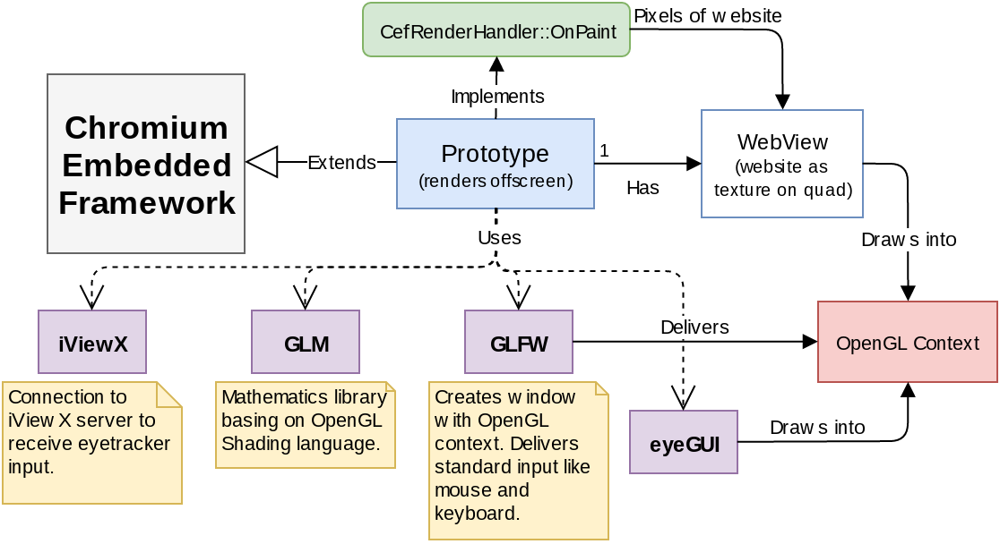

# GazeTheWeb - Browse: Prototype
Prototype of gaze controlled web browser, part of the EU-funded research project MAMEM.

## Structure


## HowTo
Please refer to the Readme in the [parent folder](https://github.com/MAMEM/GazeTheWeb/tree/master/Browse) for details about compiling.

For configuration, edit the lines 12-15 in _src/EntryPoint.h_:
```C++
//#define USE_EYETRACKER // Only with connected SMI RED eyetracker for the moment
const int WINDOW_WIDTH = 1280;
const int WINDOW_HEIGHT = 720;
const bool FULLSCREEN = false; // Uses operation system resolution
```
If the eyetracker definition is not used, the input from the connected mouse emulates gaze.

## Dependencis
All necessary dependencies are provided in the _externals_ folder.
* GLM: http://glm.g-truc.net/0.9.7/index.html (MIT license chosen)
* GLFW3: http://www.glfw.org
* iViewX: Connection to the iViewX SDK, copyright SMI GmbH (http://www.smivision.com/)
* eyeGUI: https://github.com/raphaelmenges/eyeGUI
  * FreeType 2.6.1: http://www.freetype.org/ (FreeType license chosen)

## TODO
* Reload page in current resolution at resize of window
* Crashes when closing window
* Get rid of compiled dependencies and use git submodule
