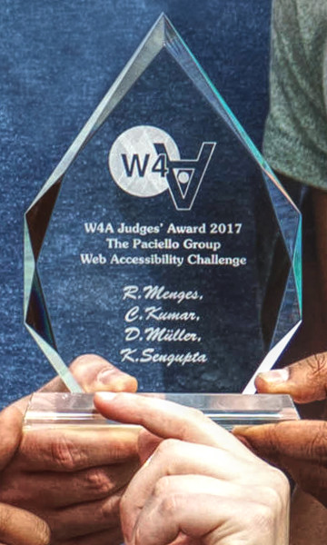

# GazeTheWeb
Software repository of the nstitute for Web Science and Technologies at University of Koblenz-Landau in context of MAMEM, for accesing the Web using eye and mind. 

## Cloning
This project uses Git submodules. Please check it out using:
```
git clone https://github.com/MAMEM/GazeTheWeb
cd GazeTheWeb
git submodule init
git submodule update
```
When submodules are updated, one has to execute this manual update call again.

## Projects
There are multiple subprojects in this repository:
* [**Browse**](Browse) Web browser controlled by your gaze
* [**Tweet**](Tweet) Twitter application developed by students in research lab *(no longer in development)*
Visit the [**wiki**](https://github.com/MAMEM/GazeTheWeb/wiki) for troubleshooting.

## Links
* [**Project page**](http://west.uni-koblenz.de/en/research/gazetheweb) Official project page
* [**Institute for Web Science and Technologies**](http://west.uni-koblenz.de) Website of our institute
* [**YouTube Channel**](https://www.youtube.com/channel/UCiM5FSmeFyeU1s4tj_e794Q) Latest videos of the project
* [**Twitter**](https://twitter.com/GazeTheWeb) Follow us on Twitter
* [**MAMEM**](http://www.mamem.eu) GazeTheWeb is part of the EU-funded project MAMEM
* [**eyeGUI**](https://github.com/raphaelmenges/eyegui) User interface library for eye-controlled applications
