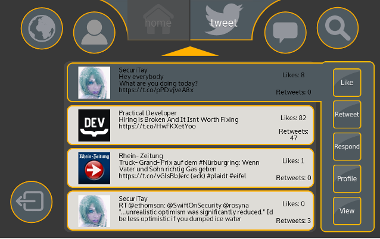

# GazeTheWeb - Tweet

Twitter application controlled with gaze, part of the EU-funded research project MAMEM. Developed as part of a research lab supervised by Dr. Chandan Kumar and Raphael Menges. Does work on Windows with Visual Studio 2015 as 32bit project or on Linux with GCC 5.x as 64bit project.

## Developers
The application was entirely designed and developed by the following students who participated in the research lab:
Svenja Neuneier, Dennis Hahn, Caterine Ospina Ocampo, Sergei Diez, Saskia Handabura, Kim Ballmes, Wojciech Kwasnik, Benjamin Stephan, Eike Idczak, Matthias Barde, Annika Wießgügel and Philipp Weber

## HowTo
Use CMake to create a project either for Visual Studio 2015 or Unix Makefile. The provided CMakeLists.txt should find all necessary dependencies in the _externals_ folder. As default, mouse control is chosen. For eyetracker support, set the CMake variable *USEEYETRACKER* to `ON`. The program tries to connect to a SMI REDn tracker by default, for connection to an Tobii EyeX tracker one has to set the variable *USETOBII* to `ON`, in addition.

For showing in fullscreen, one has to add '-fullscreen' to the execution arguments. To activate the console, the same procedure with "-console" has to be done. Both does only work on Windows.

## Shortcuts
ESC: Exit application

## Dependencies
All necessary dependencies are provided in the _externals_ folder.
* GLM: http://glm.g-truc.net/0.9.7/index.html (MIT license chosen)
* GLFW3: http://www.glfw.org
* iViewX: Connection to the iViewX SDK, copyright SMI GmbH (http://www.smivision.com)
* TobiiEyeX: Connection to Tobii EyeX SDK, copyright Tobii Technology AB (http://developer.tobii.com/eyex-sdk)
* twitCurl: https://github.com/swatkat/twitcurl
* RapidJSON: https://github.com/miloyip/rapidjson
* Autocomplete with Trie: https://github.com/vivekn/autocomplete
* eyeGUI: https://github.com/raphaelmenges/eyeGUI
  * FreeType 2.6.1: http://www.freetype.org (FreeType license chosen)

## Acknowledgments
* Readme and release prepared by Raphael Menges

## Issues
* Twitter API limits amount of access in a certain time frame

## License
>Copyright 2016 Svenja Neuneier, Dennis Hahn, Caterine Ospina Ocampo, Sergei Diez, Saskia Handabura, Kim Ballmes, Wojciech Kwasnik, Benjamin Stephan, Eike Idczak, Matthias Barde, Annika Wießgügel, Philipp Weber

>Licensed under the Apache License, Version 2.0 (the "License"); you may not use this file except in compliance with the License. You may obtain a copy of the License at

>		http://www.apache.org/licenses/LICENSE-2.0

>Unless required by applicable law or agreed to in writing, software distributed under the License is distributed on an "AS IS" BASIS, WITHOUT WARRANTIES OR CONDITIONS OF ANY KIND, either express or implied. See the License for the specific language governing permissions and limitations under the License.
